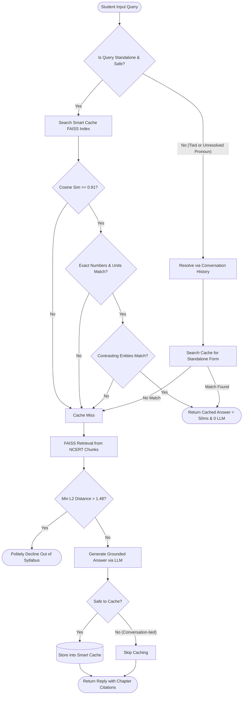

# One-Page Explainer: Architecture & Approach

**Project:** NCERT Class 10 Science Chatbot with Smart Caching  
**Position:** AI Intern – Prepzy.ai (GlobusLearn Services India Pvt. Ltd)  
**Author:** AI Intern Candidate  

---

## 1. System Overview & Request Flowchart

The system is designed with two core objectives:
1. Provide accurate, textbook-grounded answers to NCERT Class 10 Science doubts with precise chapter citations.
2. Deliver a **safe, instant (< 500 ms), zero-LLM smart cache** that eliminates repeated LLM calls without risking hallucination or misinformation.

---

## 2. The Smart Cache: How It Works & Safety Verification

Standard semantic caching using simple cosine similarity is unsafe for science education. A high similarity score often occurs between `concave mirror` and `convex mirror`, or `R = 20 cm` and `R = 30 cm`. Serving the wrong answer to a student teaches false physics.

To solve this, our **Smart Cache** executes a multi-tiered verification pipeline in under 20 ms without invoking any LLM:

1. **Normalized Bi-Encoder Embeddings (`IndexFlatIP`)**:
   We compute cosine similarity over query embeddings using `sentence-transformers/all-MiniLM-L6-v2`. A high threshold ($\ge 0.91$) ensures semantic intent is tightly coupled.
2. **Numeric & Unit Consistency Guard**:
   Regex parses numerical values and physical units (e.g., `20 cm`, `30 cm`, `5 A`, `10 V`). If the query contains any numeric values that differ from the cached record, the cache hit is immediately aborted.
3. **Domain Contrast Guard**:
   A curated set of physical opposites and contrasting scientific concepts (e.g., `concave` vs `convex`, `series` vs `parallel`, `aerobic` vs `anaerobic`, `acid` vs `base`) is checked. Any mismatch prevents false cross-concept collisions.
4. **Context-Aware Rewrite for Follow-ups**:
   Queries with unresolved pronouns (e.g., *"What about its laws?"*) are not served directly from cache. If preceding turns establish that the subject is *refraction*, the question is reformulated into *"What are the laws of refraction?"* and can then safely match cached answers.

---

## 3. What We Cache vs. What We Never Cache

| Cache Policy | Question Categories & Examples | Reason |
|---|---|---|
| **Always Cache** | Standalone factual and conceptual doubts (*"What is refraction?"*, *"Define Ohm's Law"*, *"Why do stars twinkle?"*). | Reusable, textbook-grounded, high student recurrence. |
| **Never Cache** | **Conversation-tied requests** (*"Explain it more simply"*, *"Make it shorter"*, *"Give an analogy"*). | Dynamic and pedagogical; depends directly on user feedback to the previous turn. |
| **Never Cache** | **Unresolved pronoun queries** (*"What about its laws?"*, *"Why does it happen?"*). | Context-dependent; must first be resolved to a canonical form before looking up or saving. |
| **Never Cache** | **Out-of-syllabus declines** (*"Explain quantum computing"*). | Not useful educational content. |

---

## 4. What Didn't Work & Lessons Learned

1. **Pure Cosine Similarity Thresholds (0.80 - 0.88)**:
   Initially tested standard 0.85 cosine cutoff. Questions like *"Image formed by a concave mirror"* and *"Image formed by a convex mirror"* yielded similarities around 0.88. This caused catastrophic false positives. Solution: Raised cutoff to 0.91 + added the Domain Contrast Guard.
2. **LLM-as-a-Judge for Cache Verification**:
   Having an LLM determine whether question A and B are equivalent took 400–700 ms and defeated the zero-cost requirement. Transitioning to deterministic entity/number filters reduced verification latency to **< 15 ms**.
3. **Naive Text Splitting on PDF Text**:
   Direct splitting without header/footer cleaning resulted in repeated NCERT copyright and rationalization headers appearing in chunks. Added regex sanitization prior to chunking.
